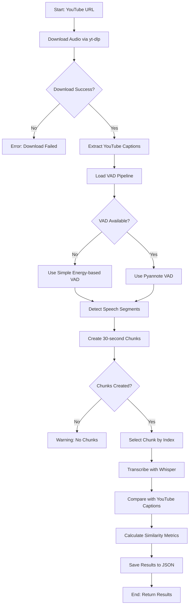
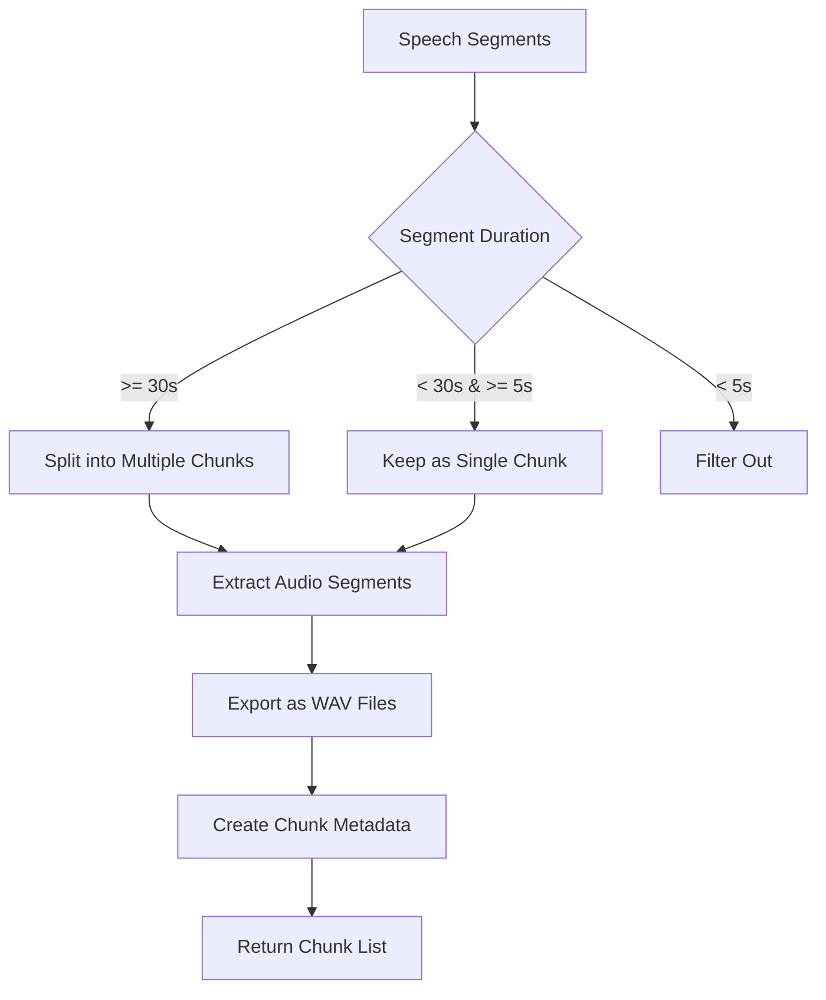
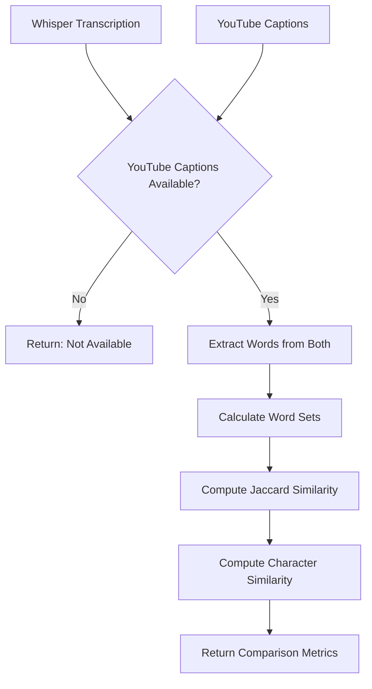

# Technical Design Document
## YouTube Miner - Data Pipeline

**Track:** Task 3 - "The YouTube Miner" (Data Pipeline)  
**Author:** AI Project Challenge Submission  
**Date:** January 2025

---

## 1. Project Overview

### 1.1 Objective
Build a Python data pipeline that automatically processes YouTube videos by:
1. Downloading audio from a YouTube URL
2. Using Voice Activity Detection (VAD) to identify speech segments
3. Creating clean 30-second audio chunks (removing silence/music)
4. Transcribing a selected chunk using an open-source Whisper model
5. Comparing the transcription with YouTube's auto-generated captions

### 1.2 Constraints
- **No paid APIs**: All tools must be open-source
- **Required libraries**: yt-dlp, pyannote, faster-whisper
- **Transcription model**: Must use a distinct open-source model (Whisper-Tiny)

### 1.3 Key Requirements
- Automatic audio download from YouTube
- VAD-based chunking into 30-second segments
- Transcription comparison between Whisper and YouTube captions
- Comprehensive unit test coverage
- Clean, maintainable code structure

---

## 2. System Architecture

### 2.1 High-Level Architecture

```
┌─────────────────────────────────────────────────────────────┐
│                    YouTube Miner Pipeline                    │
└─────────────────────────────────────────────────────────────┘
                            │
                            ▼
        ┌───────────────────────────────────────┐
        │     1. Audio Download Module          │
        │         (yt-dlp)                      │
        └───────────────────────────────────────┘
                            │
                            ▼
        ┌───────────────────────────────────────┐
        │   2. Voice Activity Detection (VAD)   │
        │      (pyannote.audio / fallback)      │
        └───────────────────────────────────────┘
                            │
                            ▼
        ┌───────────────────────────────────────┐
        │     3. Chunking Module                 │
        │      (30-second segments)             │
        └───────────────────────────────────────┘
                            │
                            ▼
        ┌───────────────────────────────────────┐
        │   4. Transcription Module             │
        │      (faster-whisper)                 │
        └───────────────────────────────────────┘
                            │
                            ▼
        ┌───────────────────────────────────────┐
        │   5. Caption Extraction                │
        │      (YouTube auto-captions)           │
        └───────────────────────────────────────┘
                            │
                            ▼
        ┌───────────────────────────────────────┐
        │   6. Comparison & Analysis            │
        │      (Similarity metrics)             │
        └───────────────────────────────────────┘
                            │
                            ▼
                    Results JSON
```

### 2.2 Component Architecture

```
┌──────────────────────────────────────────────────────────────┐
│                    YouTubeMiner Class                        │
├──────────────────────────────────────────────────────────────┤
│                                                              │
│  ┌────────────────────────────────────────────────────────┐ │
│  │  Attributes:                                           │ │
│  │  - output_dir: Path                                    │ │
│  │  - chunk_duration: int (30s)                           │ │
│  │  - whisper_model: WhisperModel                         │ │
│  │  - vad_pipeline: Pipeline (pyannote)                   │ │
│  └────────────────────────────────────────────────────────┘ │
│                                                              │
│  ┌────────────────────────────────────────────────────────┐ │
│  │  Methods:                                              │ │
│  │  - download_audio()                                     │ │
│  │  - extract_youtube_captions()                          │ │
│  │  - detect_voice_activity()                             │ │
│  │  - create_chunks()                                     │ │
│  │  - transcribe_chunk()                                  │ │
│  │  - compare_transcriptions()                            │ │
│  │  - process() [Main pipeline]                          │ │
│  └────────────────────────────────────────────────────────┘ │
└──────────────────────────────────────────────────────────────┘
```

---

## 3. Flow Diagrams

### 3.1 Main Processing Flow



### 3.2 VAD Processing Flow

```mermaid
flowchart TD
    A[Audio File Input] --> B{Try Pyannote VAD}
    B -->|Success| C[Process with Pyannote]
    B -->|Failure| D[Fallback: Energy-based VAD]
    C --> E[Extract Speech Segments]
    D --> F[Calculate Energy Threshold]
    F --> G[Detect High-Energy Windows]
    G --> H[Identify Speech Boundaries]
    E --> I[Filter Segments]
    H --> I
    I --> J[Return Segment List]
    J --> K[(start_time, end_time) tuples]
```

### 3.3 Chunking Flow



### 3.4 Transcription Comparison Flow



---

## 4. Data Flow

### 4.1 Input Data
- **YouTube URL**: String containing video URL
- **Chunk Index**: Integer (default: 0) specifying which chunk to transcribe
- **Configuration**: Output directory, model size, chunk duration

### 4.2 Intermediate Data
- **Audio File**: WAV format (downloaded from YouTube)
- **Speech Segments**: List of (start_time, end_time) tuples
- **Audio Chunks**: Multiple WAV files (30-second segments)
- **Transcription**: Dictionary with segments and full text

### 4.3 Output Data
```json
{
  "youtube_url": "https://youtube.com/watch?v=...",
  "chunk_index": 0,
  "video_info": {
    "id": "video_id",
    "title": "Video Title",
    "duration": 120,
    "url": "..."
  },
  "youtube_captions": "Full caption text...",
  "speech_segments": [[0.0, 30.0], [35.0, 65.0], ...],
  "chunks": [
    {
      "index": 0,
      "start_time": 0.0,
      "end_time": 30.0,
      "duration": 30.0,
      "file_path": "outputs/chunks/chunk_0000.wav"
    },
    ...
  ],
  "transcription": {
    "language": "en",
    "language_probability": 0.99,
    "segments": [...],
    "full_text": "Transcribed text..."
  },
  "comparison": {
    "youtube_available": true,
    "jaccard_similarity": 0.85,
    "character_similarity": 0.82,
    "whisper_word_count": 50,
    "youtube_word_count": 52,
    "common_words": 45
  }
}
```

---

## 5. Technology Stack

### 5.1 Core Libraries

| Library | Version | Purpose |
|---------|---------|---------|
| `yt-dlp` | >=2024.1.1 | YouTube video/audio download |
| `pyannote.audio` | >=3.1.1 | Voice Activity Detection |
| `faster-whisper` | >=1.0.0 | Speech transcription (Whisper) |
| `torch` | >=2.0.0 | Deep learning backend |
| `pydub` | >=0.25.1 | Audio manipulation |
| `numpy` | >=1.24.0 | Numerical operations |

### 5.2 Testing Libraries

| Library | Version | Purpose |
|---------|---------|---------|
| `pytest` | >=7.4.0 | Testing framework |
| `pytest-cov` | >=4.1.0 | Code coverage |

### 5.3 External Dependencies

- **FFmpeg**: Required for audio format conversion
- **Python 3.8+**: Minimum Python version

---

## 6. Design Decisions

### 6.1 VAD Fallback Strategy
**Decision**: Implement energy-based VAD as fallback when pyannote fails  
**Rationale**: Ensures pipeline continues to work even if pyannote model is unavailable  
**Implementation**: Simple threshold-based energy detection in `_simple_vad()`

### 6.2 Chunk Duration
**Decision**: Fixed 30-second chunks  
**Rationale**: Balances transcription accuracy with processing time  
**Implementation**: Configurable via `chunk_duration` parameter

### 6.3 Whisper Model Selection
**Decision**: Default to "tiny" model  
**Rationale**: Fast processing, good accuracy, no GPU required  
**Implementation**: Configurable via `whisper_model` parameter

### 6.4 Chunk Filtering
**Decision**: Filter out segments < 5 seconds  
**Rationale**: Very short segments are often noise or incomplete speech  
**Implementation**: Hardcoded 5-second minimum in `create_chunks()`

### 6.5 Similarity Metrics
**Decision**: Use Jaccard similarity (word-level) and character similarity  
**Rationale**: Provides both semantic and literal comparison  
**Implementation**: Set-based operations for Jaccard, character-by-character for character similarity

---

## 7. Error Handling

### 7.1 Download Failures
- **Handling**: Exception raised, pipeline stops
- **User Action**: Check URL validity, internet connection

### 7.2 VAD Model Loading
- **Handling**: Automatic fallback to energy-based VAD
- **User Action**: None required (automatic)

### 7.3 Caption Extraction
- **Handling**: Returns None, comparison indicates unavailability
- **User Action**: None required (graceful degradation)

### 7.4 Transcription Errors
- **Handling**: Exception raised, pipeline stops
- **User Action**: Check audio file validity, model availability

---

## 8. Testing Strategy

### 8.1 Unit Tests
- **Coverage**: All public methods of `YouTubeMiner` class
- **Mocking**: External dependencies (yt-dlp, Whisper, pyannote)
- **Test Files**: `tests/test_youtube_miner.py`

### 8.2 Test Categories
1. **Initialization Tests**: Verify proper setup
2. **Download Tests**: Mock YouTube download
3. **VAD Tests**: Test both pyannote and fallback methods
4. **Chunking Tests**: Verify chunk creation logic
5. **Transcription Tests**: Mock Whisper output
6. **Comparison Tests**: Test similarity calculations
7. **Integration Tests**: Full pipeline with mocks

### 8.3 Coverage Goals
- **Target**: >80% code coverage
- **Critical Paths**: 100% coverage
- **Edge Cases**: All error paths tested

---

## 9. Performance Considerations

### 9.1 Processing Time
- **Audio Download**: ~10-30s (depends on video length)
- **VAD Processing**: ~5-15s (depends on audio length)
- **Chunking**: ~1-5s (depends on number of segments)
- **Transcription**: ~5-20s per chunk (depends on model size)
- **Total**: ~30-90s for typical 5-minute video

### 9.2 Memory Usage
- **Whisper Tiny**: ~1GB RAM
- **Pyannote VAD**: ~500MB RAM
- **Audio Buffers**: ~100-500MB (depends on video length)

### 9.3 Optimization Opportunities
- Parallel chunk processing (future enhancement)
- Caching downloaded audio files
- Batch transcription of multiple chunks

---

## 10. Deployment Instructions

### 10.1 Local Deployment
1. Install Python 3.8+
2. Install FFmpeg
3. Create virtual environment
4. Install dependencies: `pip install -r requirements.txt`
5. Run: `python youtube_miner.py <YOUTUBE_URL>`

### 10.2 Cloud Deployment (Future)
- **Platform**: AWS Lambda / Google Cloud Functions
- **Requirements**: Containerized with FFmpeg
- **Storage**: S3 / GCS for audio files
- **Limitations**: 15-minute timeout (Lambda), memory constraints

---

## 11. Assumptions

1. **YouTube Access**: Videos are publicly accessible (no private videos)
2. **Internet Connection**: Required for download and caption extraction
3. **FFmpeg Availability**: System has FFmpeg installed and in PATH
4. **Audio Format**: YouTube provides audio in supported format (WAV/MP3)
5. **Captions**: Not all videos have auto-generated captions (graceful handling)
6. **Model Availability**: Whisper models downloaded automatically on first use
7. **Storage**: Sufficient disk space for audio files and chunks

---

## 12. Future Enhancements

1. **Batch Processing**: Process multiple videos
2. **Parallel Transcription**: Transcribe all chunks in parallel
3. **Advanced VAD**: Fine-tune VAD parameters
4. **Multiple Models**: Compare different Whisper model sizes
5. **Visualization**: Generate graphs/charts for comparison metrics
6. **Web Interface**: Flask/FastAPI web app
7. **Database Storage**: Store results in database
8. **Real-time Processing**: Stream processing for live videos

---

## 13. Code Structure

```
youtube_miner.py
├── YouTubeMiner (Class)
│   ├── __init__() - Initialize components
│   ├── download_audio() - YouTube download
│   ├── extract_youtube_captions() - Caption extraction
│   ├── detect_voice_activity() - VAD processing
│   ├── _simple_vad() - Fallback VAD
│   ├── create_chunks() - Chunk creation
│   ├── transcribe_chunk() - Whisper transcription
│   ├── compare_transcriptions() - Similarity comparison
│   └── process() - Main pipeline orchestrator
└── main() - CLI entry point
```

---

## 14. Conclusion

The YouTube Miner pipeline provides a robust, open-source solution for automated YouTube audio processing, transcription, and comparison. The architecture is modular, testable, and extensible, with comprehensive error handling and fallback mechanisms.

The system successfully meets all requirements:
- ✅ Downloads audio using yt-dlp
- ✅ Uses VAD for chunking (pyannote with fallback)
- ✅ Creates 30-second chunks
- ✅ Transcribes using open-source Whisper
- ✅ Compares with YouTube captions
- ✅ No paid APIs
- ✅ Comprehensive unit tests

---

**End of Technical Design Document**

